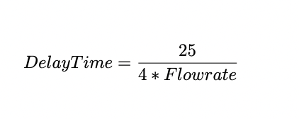
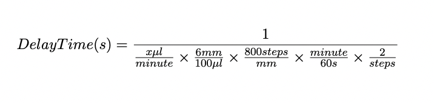
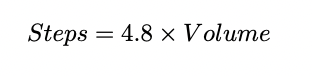

# Syringe pump
Upright syringe pump for laboratory fluidics. 10ml/30ml

# Commercial parts:
Linear stage: https://www.amazon.ca/dp/B09J4FRZQM/ref=sspa_dk_detail_0?pd_rd_r=6cb2d65c-4c96-45af[…]FpbCZhY3Rpb249Y2xpY2tSZWRpcmVjdCZkb05vdExvZ0NsaWNrPXRydWU&th=1 

Motor: https://www.amazon.ca/Twotrees-Stepper-42BYGH-Degree-Printer/dp/B08C28V44F/ref=sr_1[…]or%2525252Bnema%2525252B17%2525252Caps%2525252C286&sr=8-6&th=1

Motor driver: https://www.amazon.ca/TB6600-Stepper-Driver-Controller-tb6600/dp/B07B9ZQF5D/ref=sr_[…]45839654&sprefix=tb6600%25252525252Caps%25252525252C115&sr=8-2

Microswitch: https://leeselectronic.com/en/product/3804-micro-switch-spdt-short-roller-12a-125v-v-12-fl22-c1.html Disclaimer: Our switch holder is specfically design for this switch, if you are using a different switch the part needs to be redesign for switch-holder-top and siwtch-holder-bottom.

# Communication Protocol

So as we design the communication protocol, we need to send strings via serial communication. The functions that we need include:

**set_volume**: Set the volume of the fluid in the syringe

**set_flowrate**: Set the flow rate of the fluid in the syringe

**push**: Push from the syringe pump

**draw**: draw from the syringe pump 

**stop**: Stop the syringe pump

**whoami**: checking the identity of the pump (10ml or the 30ml pump)

**get_status**: 

state = 0: idle, not doing anything, stopped.

state = 1: The pump is currently drawing

state = 2: The pump is currently pushing

# Command sent from MATLAB/Serial monitor:

We decided on the serial command that was being sent from MATLAB should have the format of “string, the number”. Basically is a string of word comma numbers. The word here is to select functions and the number is for volume and flowrate. 

For example, if we want to set the volume as 2ml (need to convert to microliter) for the 10ml pump the serial command would be 

“setvolume,2000”

As another example, if we want to call other functions that don’t require a second argument as a number(let’s say it’s the push function), it would be

“push,“

# Conversion for the flowrate:

6400 steps per revolution, with 8mm per revolution for the lead screw. So every step moves 0.00125mm.

6mm = 1000ul (We measured this);1ul = 6/1000 mm

1step = 0.00125mm; 1mm = 800 steps

Flowrate is in ul/minutes

So the delay time in Arduino would be

The whole calculatioin for the conversion for the flowrate goes here

The steps that's required to push thourgh the volume is:

